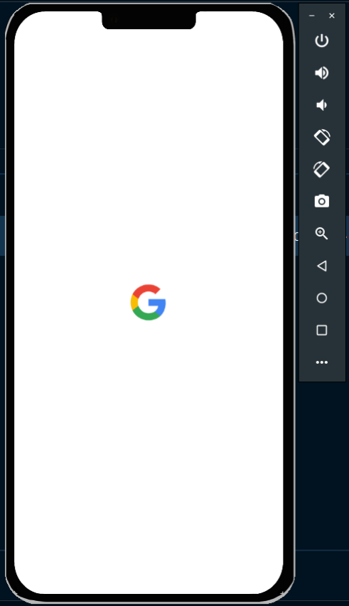
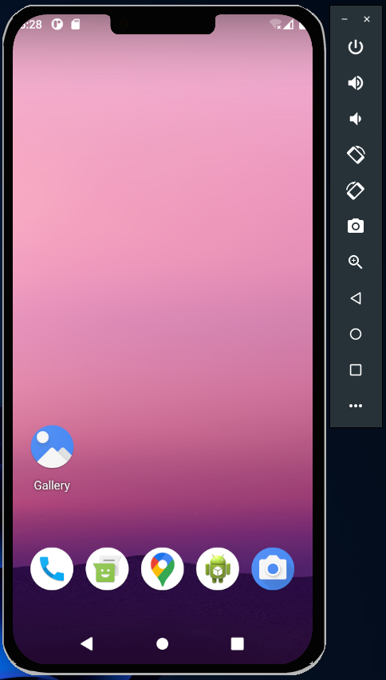
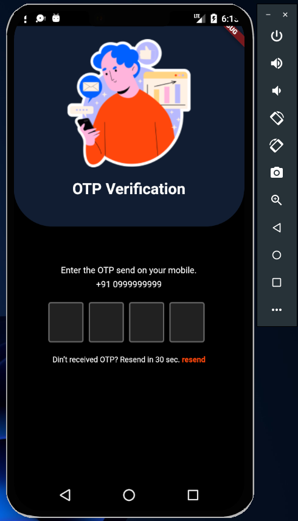
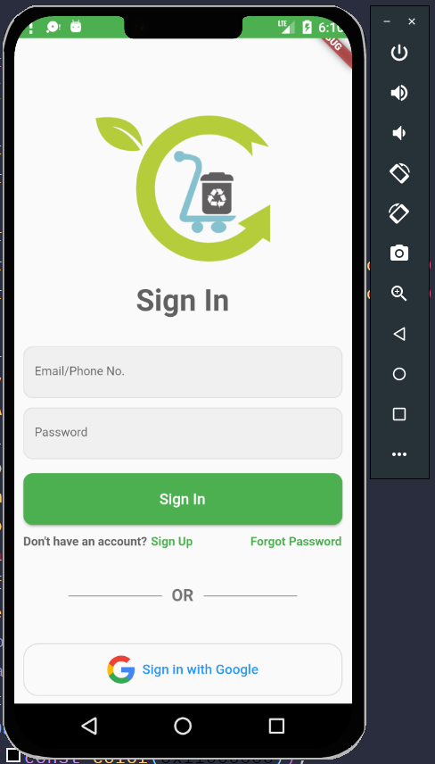

# **Android Emulator Custom Skin**

IPhone looking android emulator (IEmulator) 😍.

 

# Screenshots

 

# Docs

## Step 1

- Clone `IEmulator` Repo.
- Open Android Virtual Device Manger.
- Click on `Create Virtual Device`

## Step 2

- Create New Hardware profile by clicking on `New Hardware Profile`.

## Step 3

- Give Name
- Change Resolution. (1080x2340)
- Scroll and choose skin `(IEmulator Cloned repo)`.

## Step 4

- Create virtual device
- Select newly create Hardware profile `(Custom skin)`.
- Click `Next`

# Step 5

- Choose Device Image (OS).
- Click `Next`
  

# Step 6

- Click `Finish`.
- **All Done!**
  

## **Thank You! ❣️**
